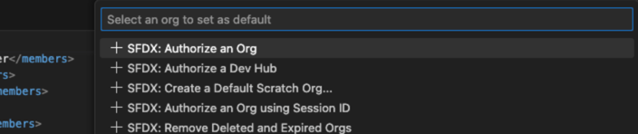

## 1. Set Up Your Dev Environment

Before you generate a new Salesforce plugin, set up these prerequisites.

Install or update Node.js.

To build a Salesforce CLI plugin, you need the latest long-term support (LTS) version of Node.js. If you’re new to Node.js development, we suggest that you use nvm (Node Version Manager) to install Node.js. See this installation script to install or update nvm.

To check your Node.js version, run:

```bash
node --version
If your node version is earlier than 8 (or if you don’t have Node.js installed), run this command to install LTS:
```

````bash
sudo npm install -g yarn
Install TypeScript (target es2017.)

```bash
npm install -g typescript
````

Salesforce CLI plugins can use JavaScript instead of TypeScript, but the classes in the Salesforce DX core library are written in TypeScript.

Install or update Salesforce CLI.

If you don’t have Salesforce CLI installed on your computer, see Install the Salesforce CLI in the Salesforce CLI Setup Guide to install both the sfdx and sf executables. After installing, update Salesforce CLI to ensure you’re on the latest version; this command updates both executables.

```bash
sfdx update
We recommend you use Visual Studio Code with Salesforce Extensions as your IDE, because it includes tools for developing on the Salesforce platform.
```

## 2. (move to step 3 first, if you cannot install plugin plugin-switch-np then back to this step) Build
To build the plugin locally, make sure to have yarn installed and run the following commands:
```bash
# Clone the repository
git clone https://github.com/nphan-sts/plugin-switch.git

# Install the dependencies and compile
cd plugin-switch
yarn && yarn build
# Link your plugin to the sf cli
sf plugins link .
# To verify
sf plugins
```


## 3.Create SFDX project with manifest 
```bash
cd ../
sfdx force:project:create --projectname "plugin-switch-sfdx" --manifest
cd plugin-switch-sfdx
git init
# Install plugin switch if fails back to step 2 
sf plugins install plugin-switch-np
```
Copy package.xml in LPC-830 to package.xml file

```bash
# init commit
git add .
git commit -m "first commit"
```

## 4. Authorizing target Org



## 5. Retrieve components, then switch off , when migration completes, switch on 
```bash
sf switch:retrieve --package manifest/package.xml
sf switch switchOff --package manifest/package.xml
#after migration 
sf switch switchOn --package manifest/package.xml

```


## Commands

SFDX project is required

<!-- commands -->
* [`sf switch connect`](#sf-switch-connect)
* [`sf switch retrieve`](#sf-switch-retrieve)
* [`sf switch switchOff`](#sf-switch-switchoff)
* [`sf switch switchOn`](#sf-switch-switchon)

## `sf switch connect`

Authorize an org.

```
USAGE
  $ sf switch connect -u <value> [--json]

FLAGS
  -u, --username=<value>  (required) Authorize an org.

GLOBAL FLAGS
  --json  Format output as json.

DESCRIPTION
  Authorize an org.

  Have to authorize an org first.

EXAMPLES
  $ sf switch connect --username username
```

## `sf switch retrieve`

Retrieve package.xml and Git repository initialized.

```
USAGE
  $ sf switch retrieve -x <value> [--json]

FLAGS
  -x, --package=<value>  (required) Retrieve Flows, Validation Rules, Apex triggers, Process builders defined in
                         package.xml.

GLOBAL FLAGS
  --json  Format output as json.

DESCRIPTION
  Retrieve package.xml and Git repository initialized.

  Retrieve Flows, Validation Rules, Apex triggers, Process builders defined in package.xml.

EXAMPLES
  '$ sf switch:retrieve --package path/to/package.xml'
```

## `sf switch switchOff`

Change Flows,Process builders activeVersionNumber to 0, Validation Rules active to false, Apex triggers status to Inactive.

```
USAGE
  $ sf switch switchOff -x <value> [--json]

FLAGS
  -x, --package=<value>  (required) Change Flows,Process builders activeVersionNumber to 0, Validation Rules active to
                         false, Apex triggers status to Inactive. then deploy to the org.

GLOBAL FLAGS
  --json  Format output as json.

DESCRIPTION
  Change Flows,Process builders activeVersionNumber to 0, Validation Rules active to false, Apex triggers status to
  Inactive.

  Change Flows,Process builders activeVersionNumber to 0, Validation Rules active to false, Apex triggers status to
  Inactive. then deploy to the org.

EXAMPLES
  $ sf switch switchOff --package path/to/package.xml
```

## `sf switch switchOn`

Change Flows, Validation Rules, Apex triggers, Process builders to original version.

```
USAGE
  $ sf switch switchOn -x <value> [--json]

FLAGS
  -x, --package=<value>  (required) Change Flows, Validation Rules, Apex triggers, Process builders to original version.
                         then deploy to the org.

GLOBAL FLAGS
  --json  Format output as json.

DESCRIPTION
  Change Flows, Validation Rules, Apex triggers, Process builders to original version.

  Change Flows, Validation Rules, Apex triggers, Process builders to original version. then deploy to the org.

EXAMPLES
  $ sf switch switchOn --package path/to/package.xml
```
<!-- commandsstop -->
